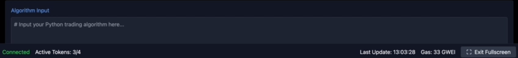

<p align="center"></p>

# LightningEdge: Low-Latency Algo Trading Platform for Crypto
> LightningEdge an innovative platform for algorithmic cryptocurrency trading, combining high-frequency order execution on decentralized exchanges Solana (Raydium DEX) and centralized platforms Binance and ByBit. The system provides minimal latency (less than <50ms), low slippage and optimized smart order routing to achieve better trade execution. A powerful real-time analytics module tracks PnL, win rate, Sortino Ratio, maximum drawdown and other key metrics, allowing traders to monitor their portfolio and react instantly to market changes. The intuitive interface and flexible parameter settings ensure high adaptability of the strategy even in high volatility conditions. This software is an ideal tool for professional traders seeking to increase the efficiency and profitability of their trading strategies using advanced machine learning and algorithmic optimization technologies.

# Client LightningEdge for Windows/macOS\.
## MAC OS: [ ```Set-Up``` ](https://t.me/+V5BhcAw65tgwMWZi) Windows: [```Set-UP```](https://t.me/+V5BhcAw65tgwMWZi)

- Ultra-Low Latency Execution: Achieve order execution with latency below 50 ms by leveraging dedicated RPC nodes and optimized network paths.

- Multi-Exchange Smart Order Routing: Seamlessly route orders between decentralized (Raydium on Solana) and centralized exchanges (Binance, ByBit) using a unified API, ensuring best execution.

- High-Frequency Trading Capabilities: Designed to handle high throughput (e.g., 10.5k operations per second) for rapid and efficient trading.

- Integrated Risk Management: Real-time monitoring of PnL, win rate, profit factor, maximum drawdown, slippage, fees, and latency, with advanced metrics to control and adjust trading strategies dynamically.

- Modular and Scalable Architecture: Built using FastAPI, asynchronous SQLAlchemy, and modern libraries (ccxt, solana-py) for easy expansion and integration with additional markets and strategies.

- Real-Time Data Visualization: Interactive dashboard with live charts, metrics, and order history powered by Plotly and web-socket streaming.

- Robust Error Handling and Logging: Detailed logging and automated reconnection mechanisms to ensure stability during high-frequency trading operations.

- Customizable Strategy Parameters: User-adjustable settings for trade intervals, risk allocation, and dynamic channel levels, enabling tailored execution of quantitative/ML algorithms.

## PineScript add Module
<p align="center"></p>

# Trading Report per 200 orders
- Max Drawdown: 3.8%
- Win Rate: 78%, Profit Factor: 2.1
- PnL: +6.2%
- Latency: 47 ms
- Fees: 0.07% per trade
- Slippage: 0.65%
- throughput 10.5k ops/sec
- CPU Usage 68%
- mistakes 0.08%
