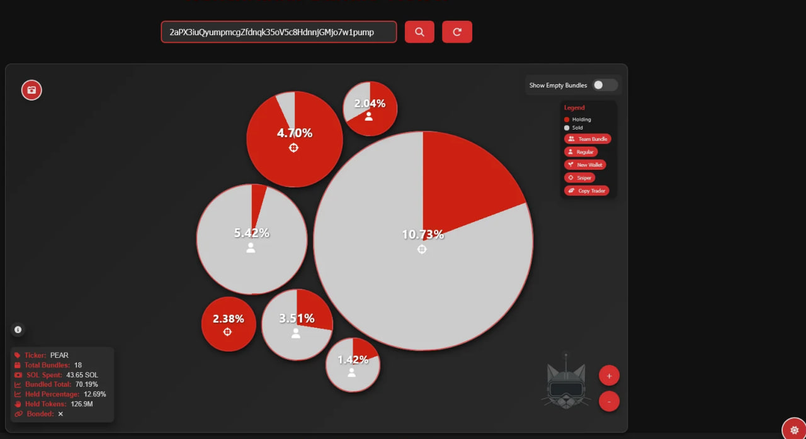

# Solana Alpha Bot: Multi-Strategy Trading Bot for DeFi, Memecoins & NFTs
> Automate your profits on Solana with a bot that combines arbitrage on DEX (Raydium, Orca), instant purchases of new memcoins, NFT investments (Mad Lads, Tensor) and airdrop farming (Kamino, Parcl). High-frequency transactions in Rust, analytics via Python, and dashboarding in React.

# Client Liquidity Guaridan Suite for Windows/macOS\.
### Write https://t.me/ZeronodeX for get access (available free trial)

# Key fixes:

- ✅ Memecoin Sniper: Purchase before anyone else via DexScreener + social triggers.
- ✅ DeFi Arbitrage: Arbitration between Raydium, OpenBook, Orca taking into account slippage.
- ✅ NFT Auto-Buy: Fractional NFTs + blue chips when price falls.
- ✅ Stop-Loss & Diversification: Capital Protection for Investors $10k+.
- ✅ No AI: Customizable strategies, Ledger/Trezor integration.

# Why Choose
- 100% Solana Ecosystem: Works with Raydium, Drift, Tensor, SharkyFi.
- No AI Algorithms: Transparent rules, manual override via React-dashboard.

> Download Solana AlphaBot and maximize ROI with Solana trends from memcoins to RWA tokenization. For traders who don't trust AI.
