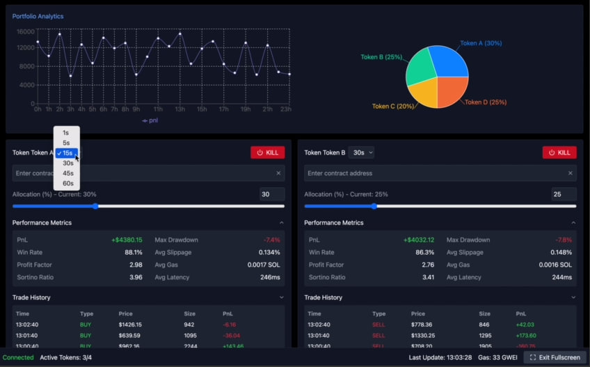
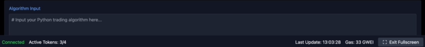
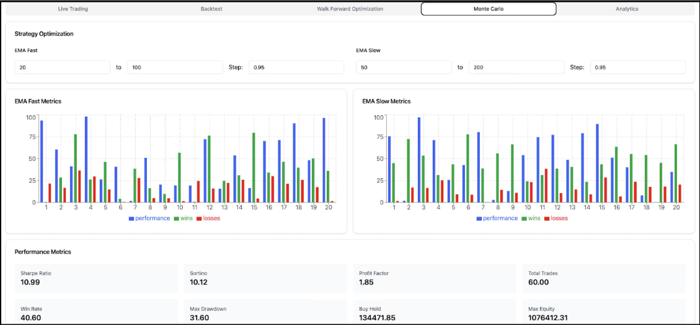
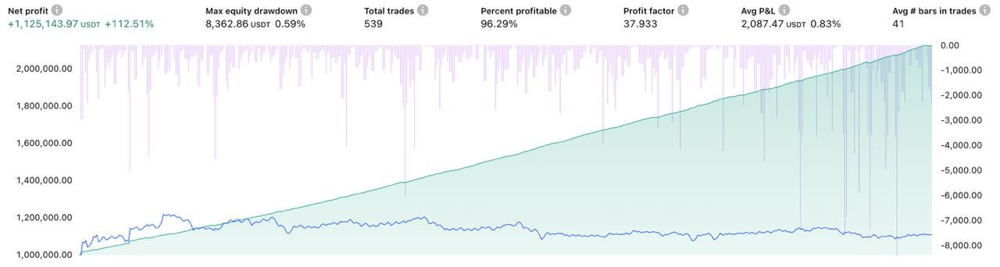

<p align="center"></p>

# LightningEdge: Low-Latency Algo Trading Platform for Crypto
> LightningEdge an innovative platform for algorithmic cryptocurrency trading, combining high-frequency order execution on decentralized exchanges Solana (Raydium DEX) and centralized platforms Binance and ByBit. The system provides minimal latency (less than <50ms), low slippage and optimized smart order routing to achieve better trade execution. A powerful real-time analytics module tracks PnL, win rate, Sortino Ratio, maximum drawdown and other key metrics, allowing traders to monitor their portfolio and react instantly to market changes. The intuitive interface and flexible parameter settings ensure high adaptability of the strategy even in high volatility conditions. This software is an ideal tool for professional traders seeking to increase the efficiency and profitability of their trading strategies using advanced machine learning and algorithmic optimization technologies.

# Client LightningEdge for Windows/macOS\.
### MAC OS: [ ```Set-Up``` ](https://t.me/+V5BhcAw65tgwMWZi) Windows: [```Set-UP```](https://t.me/+V5BhcAw65tgwMWZi)

- Ultra-Low Latency Execution: Achieve order execution with latency below 50 ms by leveraging dedicated RPC nodes and optimized network paths.

- Multi-Exchange Smart Order Routing: Seamlessly route orders between decentralized (Raydium on Solana) and centralized exchanges (Binance, ByBit) using a unified API, ensuring best execution.

- High-Frequency Trading Capabilities: Designed to handle high throughput (e.g., 10.5k operations per second) for rapid and efficient trading.

- Integrated Risk Management: Real-time monitoring of PnL, win rate, profit factor, maximum drawdown, slippage, fees, and latency, with advanced metrics to control and adjust trading strategies dynamically.

- Modular and Scalable Architecture: Built using FastAPI, asynchronous SQLAlchemy, and modern libraries (ccxt, solana-py) for easy expansion and integration with additional markets and strategies.

- Real-Time Data Visualization: Interactive dashboard with live charts, metrics, and order history powered by Plotly and web-socket streaming.

- Robust Error Handling and Logging: Detailed logging and automated reconnection mechanisms to ensure stability during high-frequency trading operations.

- Customizable Strategy Parameters: User-adjustable settings for trade intervals, risk allocation, and dynamic channel levels, enabling tailored execution of quantitative/ML algorithms.

> LightningEdge is an innovative solution designed for executing large-scale trades on the cryptocurrency market, combining the best trading platforms for institutional investors with major crypto exchanges. Our system provides a comprehensive suite of liquidity management tools that minimize slippage during large transactions and ensure the secure execution of high-value crypto trades.

# Key Advantages of LightningEdge:

## Optimization of HFT Trading Algorithms in Cryptocurrency:
**Our bot is designed with high-frequency trading in mind, enabling order execution with ultra-low latency and delivering top-notch Solana RPC performance.** 
The system leverages advanced algorithms optimized to minimize delays and slippage, ensuring that every trade is executed quickly and accurately.

**Secure Execution of Large Trades and Crypto Security for Investors:**
*LightningEdge incorporates comprehensive risk management measures, tools for monitoring PnL and drawdown, and mechanisms for institutional market regulation, ensuring reliable order execution and safeguarding your funds.

**Multi-Exchange Integration via API for Cryptocurrency Trading:**
Our platform supports trading on both decentralized exchanges (such as algorithmic trading tools on Raydium, Uniswap (v3.0, v4.0), Sushiswap, PancakeSwap, and more) and centralized platforms (Binance, ByBit, in future KuCoin, Coinbase, OXK, FTX, and more). 
**With CCXT integration for crypto exchanges, you receive a unified interface to manage orders across multiple markets.*

**Market Analytics for Institutional Investors:**
LightningEdge offers a wide range of tools for both fundamental and technical analysis of cryptocurrencies, as well as instruments for forecasting BTC/ETH prices. 
**Our analytics modules provide detailed insights into volatility, liquidity, volumes, and trends, helping you make informed decisions.*

**Liquidity Management Tools:**
**The system efficiently manages liquidity via smart order routing, optimizing order distribution across various trading venues, minimizing fees, and reducing slippage during trade execution.*

# LightningEdge is a comprehensive solution that combines:

- Advanced API technologies for cryptocurrency trading,
- High performance with minimal latency,
- A full suite of tools for monitoring PnL, drawdown, and risk management,
- Integration with leading crypto exchanges and platforms such as Raydium, Binance, and ByBit,
- Optimized trading algorithms for HFT and protection of your investments through institutional market regulation.

## PineScript
> In the software using PineScript(v6) Algorithm, but you can also add your Algorithm Strategy

## PineScript add Module
<p align="center"></p>

# Trading Report per 200 orders
- Max Drawdown: 3.8%
- Win Rate: 78%, Profit Factor: 2.1
- PnL: +6.2%
- Latency: 47 ms
- Fees: 0.07% per trade
- Slippage: 0.65%
- throughput 10.5k ops/sec
- CPU Usage 68%
- mistakes 0.08%

# Software v5.0 trading metrics
<p align="center"></p> <p align="center"></p>

## Software v5.0 net profit
<p align="center"></p>

# Next Scaling

### 1. Expansion of trading algorithms and strategies

Additional algorithms for technical analysis:
- Pulse Indicators: MACD, RSI, Stochastic, CCI
- Volatility indicators: Bollinger Bands, ATR
- Multiframe Analysis: VWAP, TWAP, EMA Crossovers
- Algorithms based on machine learning: clustering, price prediction, neural networks for pattern recognition

Arbitrage strategies:
- Inter-exchange arbitrage between CEX and DEX
- Intra-exchange arbitrage between different pairs

Scalping and high-frequency trading strategies:
- Development of algorithms optimized for low-latency operation
- Use of dollar cost averaging algorithms for multiple entries into a position

### 2. Extension of signals and parameters

Correlation-based signals:
- Tracking correlation between different tokens to identify diversified opportunities

Signals of insider activity:
- Monitoring of large transactions, concentration of wallet activity, clustering of insider transactions

Risk Parameters:
- Dynamic risk management stop loss, trailing stop, risk-to-reward ratio
- Parameters for optimizing capital allocation based on volatility and predictive signals

## 3. integration with additional exchanges (DEX and CEX)

### DEX:
In addition to Raydium on Solana, add support for Ethereum DEX (Uniswap, SushiSwap) as well as other blockchains (e.g. PancakeSwap for BSC)

### CEX:
Expand integration to work with exchanges such as Kraken, Coinbase Pro, FTX, and others via a unified CCXT library that allows multiple exchanges to work through a single API

## Improved  productivity

Expansion of backtesting and simulation capabilities:
- Historical analysis module with the ability to backtest new strategies and parameters
- Simulation of different market scenarios to optimize algorithms
