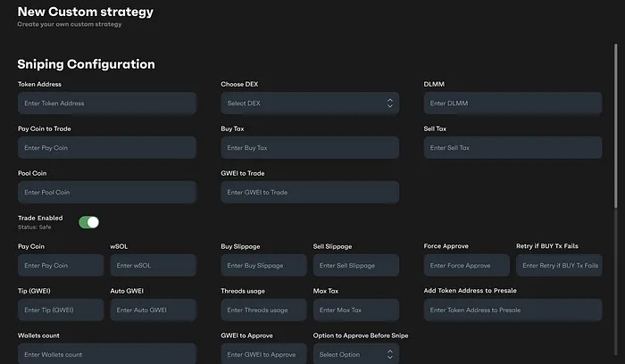

# Solana Alpha Bot: Multi-Strategy Trading Bot for DeFi, Memecoins & NFTs
Solana AlphaBot: Secure trading bot for DeFi arbitrage, memecoin sniping, and NFT auto-invest.  

Automate your profits on Solana with a bot that combines arbitrage on DEX (Raydium, Orca), instant purchases of new memcoins, NFT investments (Mad Lads, Tensor) and airdrop farming (Kamino, Parcl). High-frequency transactions in Rust, analytics via Python, and dashboarding in React.
> Tags: #solana-trading-bot #defi-arbitrage #memecoin-sniper #phantom-wallet #anchor-program

# Key fixes:

- ✅ Memecoin Sniper: Purchase before anyone else via DexScreener + social triggers.
- ✅ DeFi Arbitrage: Arbitration between Raydium, OpenBook, Orca taking into account slippage.
- ✅ NFT Auto-Buy: Fractional NFTs + blue chips when price falls.
- ✅ Stop-Loss & Diversification: Capital Protection for Investors $10k+.
- ✅ No AI: Customizable strategies, Ledger/Trezor integration.

# Why Choose
- 100% Solana Ecosystem: Works with Raydium, Drift, Tensor, SharkyFi.
- No AI, No Risks: Transparent strategies, manual override via React dashboard.
- Portable & Fast: Run natively on Windows/macOS — zero cloud dependency, 1000+ TPS.

> Download Solana AlphaBot and maximize ROI with Solana trends from memcoins to RWA tokenization. For traders who don't trust AI.

### **Download** [Windows](https://selenium-finance.gitbook.io/defi-solana-trading-bot/download/windows) / [macOS](https://selenium-finance.gitbook.io/defi-solana-trading-bot/download/macos)

# Technical Edge

- Rust Core: High-frequency Solana RPC transactions.

- Python Analytics: CoinGecko, DexScreener, and whale-tracking APIs.

- React Dashboard: Custom strategies, liquidity pools, cross-chain settings.

- Integrations: Raydium (AMM), Orca (low-slippage swaps), Jupiter (best-price routing).

**RPC/APIs:** Custom Solana RPC, CoinGecko, DexScreener. 

**DEXs:** Raydium, Orca, Serum, Jupiter.
>Fully configurable — adapt to any market condition.
>For traders and projects who value speed, security, and control. No compromises.

## Key Tags
solana arbitrage bot, memecoin sniper bot solana, high frequency trading bot solana, solana dex arbitrage strategy, solana cross-chain arbitrage, solana nft floor price bot, non-custodial solana trading bot, phantom wallet integration solana, honeypot detection solana, halborn audited crypto bot, solana anti-dump bot, raydium orca arbitrage bot, jupiter aggregator api bot, solana wormhole arbitrage, phantom wallet trading bot, solana rpc node optimization, solana stop-loss smart contract, portfolio diversification bot solana, solana risk management bot, volatility-based trading solana, solana airdrop farming automation, kamino finance bot, marginfi auto-compound bot, liquid staking bot solana, solana defi yield optimizer, solana anchor program examples, rust solana trading bot github, react solana dashboard template, whale tracking solana bot, anti-frontrunning bot solana, multi-dex liquidity optimizer
